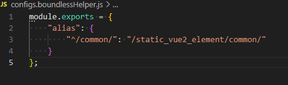

# [boundless-vue-helper](https://marketplace.visualstudio.com/items?itemName=ShoneSingLone.boundless-vue-helper)

npm install -g @vscode/vsce
vsce package
vsce login
vsce publish patch, minor, or major

## alias：跳转对应文件

- configs.boundlessHelper.js 才会启动插件探测 (package.json同目录)
- 通用的配置
  

```json
"useBoundlessVue": {
    "alias": {
      "^/common/": "/static_vue2_element/common/"
    }
  }
```

- `@`是默认`business_**`文件夹下的资源（个人项目专用）
  - 同名的`@/entry.vue` 在 `business_app/` 和 `business_doc/下`，跳转各自对应的文件

## 规则

- 引号 " ' `
- `.vue` 结尾

**/"([^"]_)\.vue"|'([^']_)\.vue'|`([^`]\*)\.vue`/**

开启后，引号内以`.vue`结尾的字符串都会被探测，满足alias映射要求的会自动拼接项目workspace rootPath

## 代码片段

- lodash
- xsfc SFC 模板（基础款）
- ximv _.$importVue


### API

>[vscode-path-alias](https://github.com/IWANABETHATGUY/vscode-path-alias)

VSCode CodeActionProvider 是一个用于提供代码修复功能的插件。它可以帮助用户自动修复代码中的错误、提供代码重构建议以及其他编辑器建议。