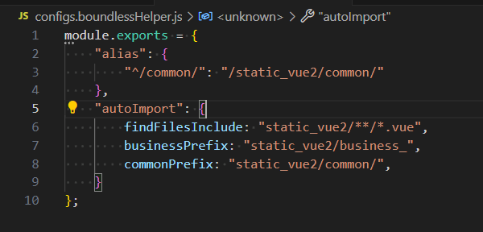

# [主项目 boundless_vue_project](https://github.com/ShoneSingLone/boundless_vue_project)

[配套插件 boundless-vue-helper](https://marketplace.visualstudio.com/items?itemName=ShoneSingLone.boundless-vue-helper)

## alias：跳转对应文件

- configs.boundlessHelper.js 才会启动插件探测 (package.json 同目录)
- 通用的配置
  

```js
module.exports = {
	alias: {
		"^/common/": "/static_vue2/common/"
	},
	analysis: {
		findFilesInclude: "static_vue2/**/*.vue",
		businessPrefix: "static_vue2/business_",
		commonPrefix: "static_vue2/common/"
	},
	globalVaribles: {
		_: "static_vue2/common/libs/common.js"
	},
	/*
	globalLodash 配置用于支持 _.\$xxx 函数跳转到 common.ts
	注意：插件现在支持自动扫描 common.ts 文件，无需手动配置此选项
	vars：函数定义映射表，格式为 {函数名: [文件标识, 行号, 列号]}
	files：文件路径映射表，格式为 {文件标识: 文件相对路径}
	*/
	globalLodash: {
		vars: {
			"$importVue": ["common", 10, 0],
			"$showMessage": ["common", 20, 0],
			"$ajax": ["common", 30, 0]
		},
		files: {
			"common": "static_vue2/common.ts"
		}
	}
	vueVaribles: {
		_api: "static_vue2/business_xxxAppNamexxx/utils/api.vue",
		_opts: "static_vue2/business_xxxAppNamexxx/utils/opts.vue"
	}
};
```
### 内置别名@ 

`@`是默认`business_**`文件夹下的资源（对应应用）
  - 同名的文件不会冲突
	- 同样是`@/entry.vue` 会跳转对应应用下的文件

## alias 跳转规则

- 引号 " ' ` 内部的 会尝试添加 js 后缀，如果是 bounndless 的组件，肯定是带.vue 后缀的

### 自动扫描 \_.$xxx 函数
**作用**: 插件会自动扫描项目中的 common.ts 文件，提取所有 \_.$xxx 函数定义，无需手动配置即可实现函数跳转。

**自动扫描位置**:
- 项目根目录: `common.ts`
- `src/common.ts`
- `static_vue2/common.ts`
- `business_common/common.ts`

**文件变化监控**: 插件会监听 common.ts 文件的变化，当文件内容更新时，会自动重新扫描函数定义。

## \_.$importVue

\_.$importVue 导入的是 vue 单文件。默认导出是 default 文件名就是变量名

- 目前只支持单个导出；
- 多个导出自己手工添加吧

开启后，引号内以`.vue`结尾的字符串都会被探测，满足 alias 映射要求的会自动拼接项目 workspace rootPath

## 代码片段

- lodash
- xsfc SFC 模板（基础款）
- xsfcdialog SFC 模板（dialog带有$closeWindow等方法）
- ximv \_.$importVue

VSCode CodeActionProvider 是一个用于提供代码修复功能的插件。它可以帮助用户自动修复代码中的错误、提供代码重构建议以及其他编辑器建议。

### context.workspaceState.get('boundlessAutoImportConfigs')

```js
//获取配置信息
context.workspaceState.get("boundlessAutoImportConfigs");
//更新
context.workspaceState.update("boundlessAutoImportConfigs", {});
```

- Vue.\_开头的业务函数 比如 \_api \_opts .vue

- \_.$开头的通用工具函数 在 common.js

- 同名组件跳转

```sh
npm install -g @vscode/vsce
vsce package
vsce login
vsce publish patch, minor, or major
```

词法高亮 词法分析

## hover函数注释信息

## 参考

- [如何开发一款 VS Code 语言插件 —— 以 vetur 为例](https://www.bilibili.com/video/BV1sh411z7Vq/?spm_id_from=333.880.my_history.page.click&vd_source=c585c94b49670e0f28d6c87eb2271489)
- [vscode-path-alias](https://github.com/IWANABETHATGUY/vscode-path-alias)
- [Auto Import](https://marketplace.visualstudio.com/items?itemName=steoates.autoimport)
- [vue-helper](https://github.com/jiaolong1021/vue-helper/tree/master)
- [esprima-ast-utils](https://www.npmjs.com/package/esprima-ast-utils)
- [vtable](https://visactor.io/vtable/demo/edit/add-delete-records)

> Big thanks to everyone who has used this over the years. If you have found this helped at all, feel free to [buy me a coffee](https://www.buymeacoffee.com/shonesinglone)!


- AI assistant

在Boundless项目中，_.$xxx的函数定义在common.ts里面，本项目作为VSCOde插件，要实现能直接跳转到函数对应位置
业务代码，不需要用户自己配置，只需要在VSCode中安装该插件，位置信息在后台自动扫描，如果对应文件有变动，会自动更新
相关代码可以参看
https://gitee.com/ShoneSingLone/boundless_static_business_yapi
通用函数
https://gitee.com/ShoneSingLone/boundless_static_common