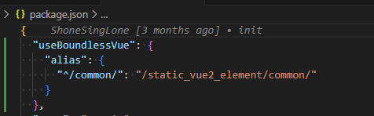

# boundless-vue-helper

## alias：跳转对应文件

- `package.json` 中添加 `useBoundlessVue` 才会启动插件探测
- 通用的配置
  

```json
"useBoundlessVue": {
    "alias": {
      "^/common/": "/static_vue2_element/common/"
    }
  }
```

- `@`是默认`business_**`文件夹下的资源（个人项目专用）
  - 同名的`@/entry.vue` 在 `business_app/` 和 `business_doc/下`，跳转各自对应的文件

## 规则

- `useBoundlessVue`为真值即开启
- 引号 " ' `
- `.vue` 结尾

**/"([^"]_)\.vue"|'([^']_)\.vue'|`([^`]\*)\.vue`/**

开启后，引号内以`.vue`结尾的字符串都会被探测，满足alias映射要求的会自动拼接项目workspace rootPath

## 代码片段

- lodash
- xsfc SFC 模板（基础款）
- ximv _.$importVue
